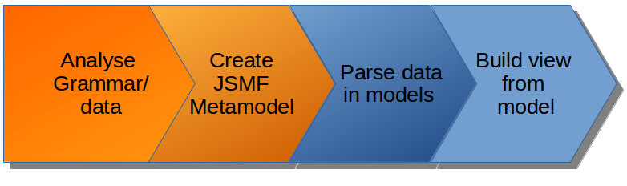

Visualization of Inter-Component Communication (ICC) and source code for Android
applications.

[JSMF](https://github.com/JS-MF) is used for the modeling of the different
facets of the applications.

[Demonstration site](http://jsmf-android-visualization.list.lu).

# Install

## Deploy on your server

```bash
$ git clone --recursive https://git.list.lu/jsmf/jsmf-interact.git
$ cd jsmf-interact/
$ ./install.sh
$ node app.js
Listening on port 3000
```

If you want to access the application to the port 80:

```bash
$ sudo iptables -t nat -A PREROUTING -i [interface] -p tcp --dport 80 -j REDIRECT --to-port 3000
```

An instance is available
[here](http://jsmf-android-visualization.list.lu).


## Deploy on Heroku

Heroku only provides 64 bits based architectures (cedar-14, heroku-16).
Consequently you will have problems with dare which is a 32 bit executable.

```bash
$ git clone https://git.list.lu/jsmf/jsmf-interact.git
$ cd jsmf-interact/
$ heroku create
$ heroku buildpacks:add --index 1 heroku/nodejs
$ heroku buildpacks:add --index 2 heroku/java
$ git push heroku master
$ heroku open
```

An instance is available
[here](https://jsmf-android-visualization.herokuapp.com).


# Concepts



The views are generated from the JSMF models of the applications.
More information [here](http://jsmf-android-visualization.list.lu/models).


# Contact

[Luxembourg Institute of Science and Technology](https://www.list.lu)
